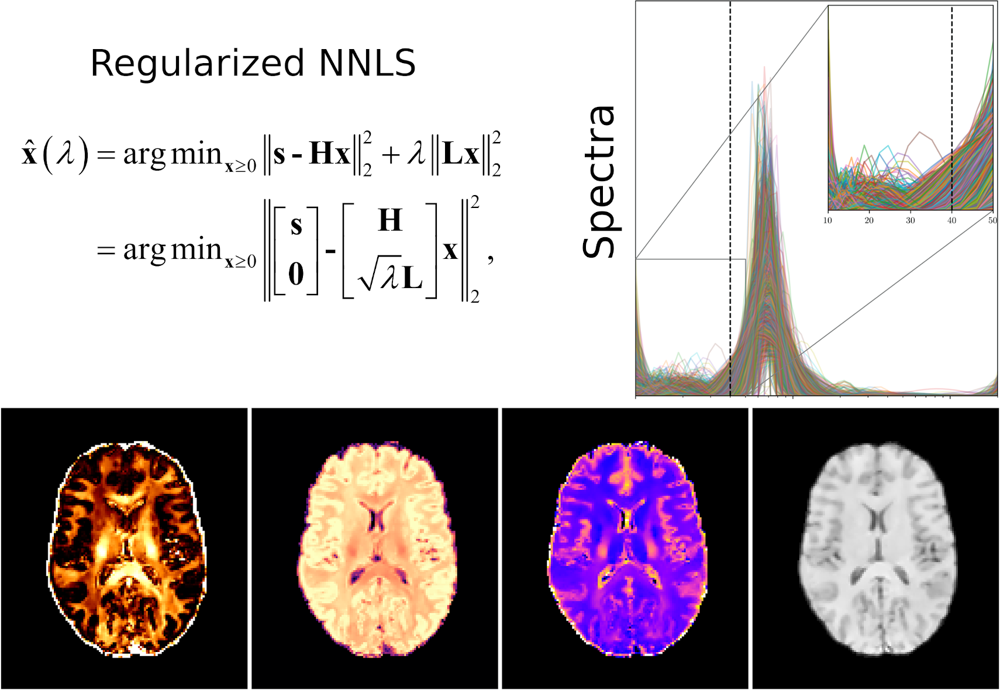

## Non-parametric T<sub>2 relaxometry methods for myelin water quantification



**Implementation of the algorithms described here:**

> **Comparison of non-parametric T2 relaxometry methods for myelin water quantification. Medical Image Analysis, under review, 2020.**
Erick Jorge Canales-Rodríguez, Marco Pizzolato, Gian Franco Piredda, Tom Hilbert, Nicolas Kunz, Caroline Pot, Thomas Yu, Raymond Salvador, Edith Pomarol-Clotet, Tobias Kober, Jean-Philippe Thiran, Alessandro Daducci.

> **T2 Spectrum Imaging for Myelin Water Quantification using Bayesian Regularized Non-Negative Least Squares. IEEE Transactions on Medical Imaging, under review, 2020**
Erick Jorge Canales-Rodríguez, Marco Pizzolato, Thomas Yu, Gian Franco Piredda, Tom Hilbert, Tobias Kober, Jean-Philippe Thiran

A number of non-parametric estimation algorithms were implemented, including the individual combinations of four penalty terms (i.e., **I** = identity matrix, **L1** = first-order Laplacian derivative, **L2** = second-order Laplacian derivative, and **InvT2** that takes into account the non-equidistant partition of the T2 grid) with four criteria to estimate the optimal regularization weight (i.e., Chi-square residual fitting (**X2**), **L-curve**, Generalized Cross-Validation (**GCV**), and a Bayesian regularized NNLS algorithm  (**BayesReg**)), as well as the non-regularized **NNLS** algorithm and **T2SPARC** (see references below).

**The current implementation is written in Python 2.7 (we plan to switch to Python 3.x.)**

**We are using the MRI acquisition sequence described here:**

> **Fast and high‐resolution myelin water imaging: Accelerating multi‐echo GRASE with CAIPIRINHA.**
Gian Franco Piredda, Tom Hilbert, Erick Jorge Canales‐Rodríguez, Marco Pizzolato, Constantin von Deuster, Reto Meuli, Josef Pfeuffer, Alessandro Daducci, Jean‐Philippe Thiran, Tobias Kober. **Magnetic Resonance in Medicine**, 2020, https://doi.org/10.1002/mrm.28427

## Install dependencies
```
- numpy
- nibabel
- numba
- matplotlib
- scipy
- skimage
- joblib
- multiprocessing
- progressbar2
- joypy
- pandas
- tabulate
```

## Help

Open a terminal and write:

```
$ python run_real_data_script.py -h

usage: run_real_data_script.py [-h] --path_to_folder PATH_TO_FOLDER --input
                               INPUT --mask MASK --minTE MINTE --nTE NTE --TR
                               TR --FA_method {spline,brute-force} --FA_smooth
                               {yes,no} --denoise {TV,NESMA,None} --reg_method
                               {NNLS,T2SPARC,X2,L_curve,GCV,BayesReg}
                               --reg_matrix {I,L1,L2,InvT2}
                               [--numcores NUMCORES] --myelin_T2_cutoff
                               MYELIN_T2_CUTOFF --savefig {yes,no}
                               --savefig_slice SAVEFIG_SLICE

Myelin Water Imaging

optional arguments:
  -h, --help            show this help message and exit
  --path_to_folder PATH_TO_FOLDER
                        Path to the folder where the data is located, e.g.,
                        /home/Datasets/MET2/
  --input INPUT         Input data, e.g., Data.nii.gz
  --mask MASK           Brain mask, e.g., Mask.nii.gz
  --minTE MINTE         Minimum Echo Time (TE, units: ms)
  --nTE NTE             Number of TEs
  --TR TR               Repetition Time (units: ms)
  --FA_method {spline,brute-force}
                        Method to estimate the flip angle (FA)
  --FA_smooth {yes,no}  Smooth data for estimating the FA
  --denoise {TV,NESMA,None}
                        Denoising method
  --reg_method {NNLS,T2SPARC,X2,L_curve,GCV,BayesReg}
                        Regularization algorithm
  --reg_matrix {I,L1,L2,InvT2}
                        Regularization matrix
  --numcores NUMCORES   Number of cores used in the computation: -1 = all
                        cores
  --myelin_T2_cutoff MYELIN_T2_CUTOFF
                        Maximum T2 for the myelin compartment: T2 threshold
                        (units: ms)
  --savefig {yes,no}    Save reconstructed maps in .png
  --savefig_slice SAVEFIG_SLICE
                        Axial slice to save reconstructed maps, e.g.,
                        --Slice=30

```

For more details see the example script: **example_script_run_MET2_preproc_and_recon.sh**.
We included some optional pre- and post-processing steps using FSL (https://fsl.fmrib.ox.ac.uk/fsl/fslwiki) and MRtrix3 (https://www.mrtrix.org/):

```
- Brain extraction for obtaining the brain mask (i.e., bet, FSL)
- Remove Gibbs ringing artifacts (i.e., mrdegibbs, MRtrix3)
- Bias-field correction of the estimated proton density map, and segmentation to obtain WM, GM, and CSF probabilistic tissue-maps (i.e., fast, FSL)
```

## Estimated maps
```
The software will save the estimated T2 distributions for each voxel (fsol_4D.nii.gz), the predicted signal (Est_Signal.nii.gz), as well as the following metrics derived from the spectrum:

- MWF.nii.gz: Myelin Water Fraction
- IEWF.nii.gz: Intra- and Extra-cellular Water Fraction
- CSFWF.nii.gz: Free-Water Fraction 
- T2_M.nii.gz: Geometric mean T2 of the myelin water.
- T2_IE.nii.gz: Geometric mean T2 of the intra- and extra-cellular water
- TWC.nii.gz: Total Water Content, i.e., proton density
- FA.nii.gz: Estimated Flip Angle per voxel
- reg_param.nii.gz: Estimated regularization parameter per voxel
```

Moreover, we included another example script: **example_script_run_MET2_preproc_and_recon_using_ROIs.sh** to show how to estimate the mean T2 distributions over regions of interest (ROIs).

## References (depending on the used method, you should cite the following papers)
> **Comparison of non-parametric T2 relaxometry methods for myelin water quantification. Medical Image Analysis, under review, 2020.**
Erick Jorge Canales-Rodríguez, Marco Pizzolato, Gian Franco Piredda, Tom Hilbert, Nicolas Kunz, Caroline Pot, Thomas Yu, Raymond Salvador, Edith Pomarol-Clotet, Tobias Kober, Jean-Philippe Thiran, Alessandro Daducci.

> **T2 Spectrum Imaging for Myelin Water Quantification using Bayesian Regularized Non-Negative Least Squares. IEEE Transactions on Medical Imaging, under review, 2020**
Erick Jorge Canales-Rodríguez, Marco Pizzolato, Thomas Yu, Gian Franco Piredda, Tom Hilbert, Tobias Kober, Jean-Philippe Thiran

> **Fast and high‐resolution myelin water imaging: Accelerating multi‐echo GRASE with CAIPIRINHA.**
Gian Franco Piredda, Tom Hilbert, Erick Jorge Canales‐Rodríguez, Marco Pizzolato, Constantin von Deuster, Reto Meuli, Josef Pfeuffer, Alessandro Daducci, Jean‐Philippe Thiran, Tobias Kober. **Magnetic Resonance in Medicine**, 2020, https://doi.org/10.1002/mrm.28427

> **Quantitative interpretation of NMR relaxation data** 
Whittall, K.P., MacKay, A.L., 1989. **J. Magn. Reson**. doi:10.1016/0022-2364(89)90011-5

> **In vivo visualization of myelin water in brain by magnetic resonance.**
Mackay, A., Whittall, K., Adler, J., Li, D., Paty, D., Graeb, D., 1994.  **Magn. Reson. Med.** 31, 673–677. doi:10.1002/mrm.1910310614

> **Applications of stimulated echo correction to multicomponent T2 analysis**
Prasloski, T., Mädler, B., Xiang, Q.S., MacKay, A., Jones, C., 2012. **Magn. Reson. Med.** doi:10.1002/mrm.23157

> **Multi-slice myelin water imaging for practical clinical applications at 3.0T**
Guo, J., Ji, Q., Reddick, W.E., 2013. **Magn. Reson. Med.** doi:10.1002/mrm.24527

## Copyright and license

**GNU Lesser General Public License v2.1**

Primarily used for software libraries, the GNU LGPL requires that derived works be licensed under the same license, but works that only link to it do not fall under this restriction.
